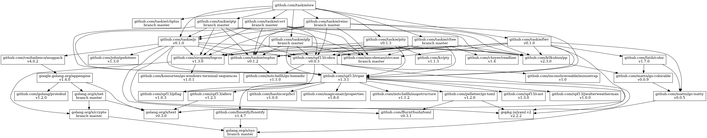

# ore

ore（俺）utils, packed in BusyBox-like way

## Install

```sh
go install github.com/taskie/ore
```

## Tools

* <https://github.com/taskie/gtp>
* <https://github.com/taskie/jc>
* <https://github.com/taskie/csvt>
* <https://github.com/taskie/fwv>
* <https://github.com/taskie/levelet>

## Usage

```
ore gtp -h
# or
ln -s "$(which ore)" gtp
./gtp -h
```

## Dependency



## License

Apache License 2.0
