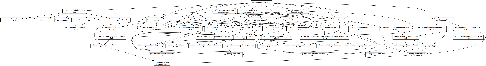

# ore

ore（俺）utils, packed in BusyBox-like way

## Install

Please check https://github.com/taskie/ore/releases

or

```sh
go get -u github.com/taskie/ore
```

## Tools

* <https://github.com/taskie/gtp>
* <https://github.com/taskie/jc>
* <https://github.com/taskie/csvt>
* <https://github.com/taskie/fwv>
* <https://github.com/taskie/pity>
* <https://github.com/taskie/rlexec>
* <https://github.com/taskie/gfp>

## Usage

### Execute a command

```sh
ore gtp -h
# or
ln "$(which ore)" gtp
./gtp -h
```

### Link commands to `${GOPATH}/bin`

```sh
ore link
ore link -f  # force
```

### Unlink commands under `${GOPATH}/bin`

```sh
ore unlink
ore unlink -f  # force
```

### Check updates of ore

```sh
ore latest status
```

### Install latest ore

```sh
ore latest install
ore link -f
# or
ore latest download
ore latest install "ore_${VERSION}_${GOOS}_${GOARCH}.tar.gz"
ore link -f
```

## Dependency



## License

Apache License 2.0
